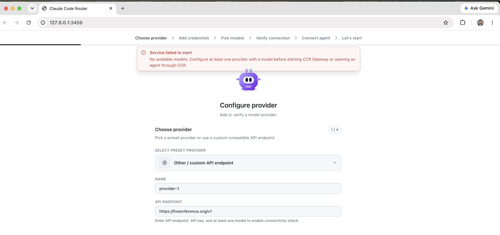
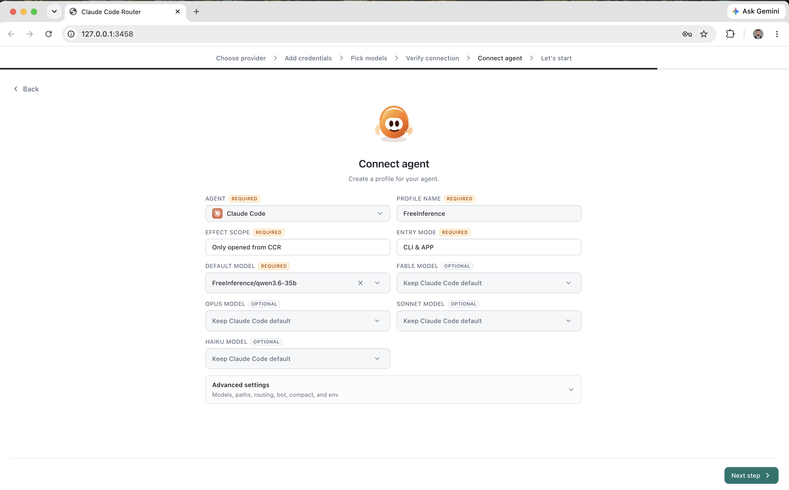
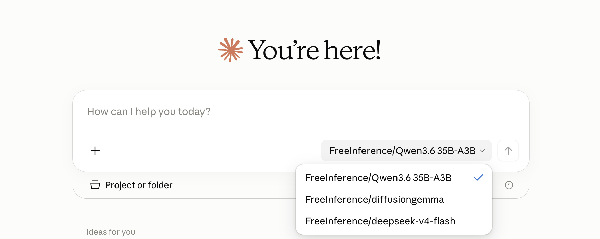

# Connect FreeInference to Claude Code using Claude Code Router (CCR)

Claude Code Router (CCR) allows Claude Code to use external model providers through a local routing gateway.

In this tutorial, we configure **[FreeInference](https://freeinference.org/)** as a provider in CCR, add FreeInference models, create a Claude Code agent profile, launch Claude Code through CCR, and verify the request in CCR logs.

---

## Why use this integration?

The biggest advantage is reusability.

Developers do not have to keep changing API endpoints, keys, or environment
variables for every Claude Code session. Provider configuration, routing, and
model selection can all be managed in one place.

For AI platform teams, this provides a useful architectural pattern:

> Keep the developer experience separate from the underlying model
> infrastructure.

This separation makes it easier to experiment with models, switch providers,
and understand how models are being used.

---

## Prerequisites

Before starting, make sure you have:

- Node.js 22 or newer
- Claude Code installed
- A FreeInference API key
- Claude Code Router (CCR)

The current CCR CLI requires Node.js 22+ and provides the ccr command and browser-based management UI.

The CCR management UI normally runs at:


## Step 1. Install Node.js
If Claude Code is not already installed, install it first.

After installation, verify it:

```bash
claude --version
```

You should see the installed Claude Code version.

## Step 2. Install Claude Code Router

Install CCR locally in the project:

```bash
npm install @musistudio/claude-code-router
```

Verify the installation:

```bash
ccr --help
```

## Step 3. Start CCR

Once CCR is installed, start its UI

```bash
ccr ui
```

CCR will start its background service and open the management interface in your browser.

for the npm CLI version, the management UI normally runs on:

```bash
http://127.0.0.1:3458
```





## Step 4. Add FreeInference as a Provider

in the CCR inference:

1. Open **Providers**.
2. Click **Add +**.
3. Select **Other / Custom API Endpoint** as the provider type.
4. Enter the provider name as **FreeInference**.
5. Enter the FreeInference API endpoint:  
   `https://freeinference.org/v1`
6. Add your FreeInference API key as the provider credential.
7. Continue to the model selection step.

> **Note:** Use `https://freeinference.org/v1` as the provider base endpoint. Do not append `/chat/completions`, `/messages`, or other request paths manually; CCR detects and uses the compatible API protocols automatically.


## Step 5. Choose FreeInference models

CCR should fetch the models exposed by FreeInference.

The following models were detected during the verified setup:

```text
minimax-m3
qwen3.6-35b
deepseek-v4-flash
bge-m3
diffusiongemma
```

For Claude Code, start with the chat/coding models:

```text
qwen3.6-35b
minimax-m3
deepseek-v4-flash
```

For the first end-to-end test, use only:

```text
qwen3.6-35b
```

as the active/default model.

Embedding and image-generation models are not needed for the initial Claude Code test.

---

## Step 6. Verify the FreeInference provider

On the **Verify connection** step, click **Check Connection**.

CCR sends a real model request to confirm that the provider and selected model are usable.

Keep automatic protocol detection enabled unless you have a specific reason to force a protocol manually.

A successful verification confirms:

```text
CCR
 |
 v
FreeInference
 |
 v
Selected model
```

before Claude Code is introduced.

---

## Step 7. Create a Claude Code agent profile

Open **Agent Profiles** and create a new Claude Code profile.

Recommended initial settings:

```text
Agent:               Claude Code
Profile name:        FreeInference
Effect scope:        Only opened from CCR
Entry mode:          CLI & APP
Default model:       FreeInference/qwen3.6-35b
Profile Routing:     Off
Enhanced Route:      Off
CCR managed compact: Off
Bot:                 Off
APP_PATH:            Empty/default
Environment vars:    Empty
```

keep:

```text
Fable model:   Keep Claude Code default
Opus model:    Keep Claude Code default
Sonnet model:  Keep Claude Code default
Haiku model:   Keep Claude Code default
```





The initial request path should be:

```text
Claude Code
    |
    v
CCR
    |
    v
FreeInference/qwen3.6-35b
```

---

## Step 8. Start Claude Code through CCR

1. Open the **Claude Code** profile.
2. Click **Start App**.

CCR will launch Claude Code using the configuration associated with that profile.



Send a simple verification prompt, for example:

```text
Reply with exactly:
FREEINFERENCE_CCR_WORKS
```

If Claude Code responds, the end-to-end path is working.

---

## Step 9. Enable request logs

Open **Logs** in CCR.

If request logs are disabled, enable them.

Then send another small request from the CCR-launched Claude Code session:

```text
Reply with exactly:
LOG_TEST_OK
```

Return to CCR and inspect the request.

---

## Step 10. Verify the request in CCR

A successful test from the verified setup showed:

```text
Status:       200
Streaming:    Yes
Model:        qwen3.6-35b
Input tokens: 3,023
Output tokens: 4
Cache:        32.8K
Duration:     2.0 s
```

CCR displayed the routed model in an Anthropic-prefixed form similar to:

```text
anthropic/.../qwen3.6-35b
```

This confirms the end-to-end path:

```text
Claude Code
    |
    | Anthropic-compatible request
    v
Claude Code Router
    |
    | local gateway
    v
FreeInference
    |
    v
qwen3.6-35b
```

Streaming was also successfully verified.

---

## Step 11. Test additional FreeInference models

After the single-model setup works, add:

```text
FreeInference/minimax-m3
FreeInference/deepseek-v4-flash
```

Test them one at a time before enabling advanced routing.

This makes failures easier to isolate.

---

## Step 12. Optional: experiment with routing

Once the basic integration is stable, CCR routing can be explored.

For example:

```text
                 +--> qwen3.6-35b
Claude Code --> CCR --> minimax-m3
                 +--> deepseek-v4-flash
```

Keep routing disabled until each model has been tested independently.

---

## Conclusion

You have now connected Claude Code to FreeInference through Claude Code Router.

The verified setup provides:

- FreeInference as a CCR provider
- Automatic API protocol detection
- FreeInference model discovery
- Claude Code agent profiles
- Local routing through CCR
- Model selection
- Streaming responses
- Request logging
- Token and latency visibility

The integration works entirely from the client side and does not require access to the FreeInference backend repository.
